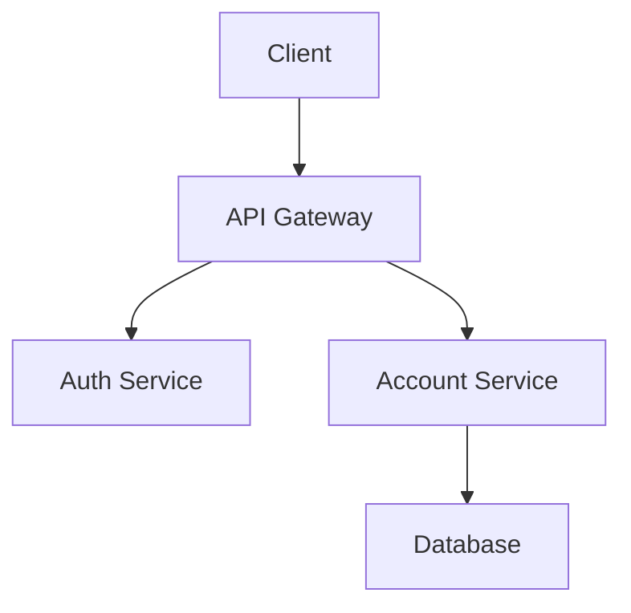

# Documentation

Bu dizin proje dokümantasyonunu içerir.

## Dizin Yapısı

```
docs/
├── architecture/       # Mimari dokümantasyon
│   ├── overview.md            # Genel mimari
│   ├── microservices.md       # Mikroservis mimarisi
│   ├── data-flow.md           # Veri akış diyagramları
│   ├── security.md            # Güvenlik mimarisi
│   ├── deployment.md          # Deployment stratejisi
│   └── diagrams/              # C4, UML diyagramları
│
├── api/               # API dokümantasyonu
│   ├── rest/         # REST API docs
│   ├── graphql/      # GraphQL API docs
│   ├── grpc/         # gRPC API docs
│   └── webhooks/     # Webhook documentation
│
└── guides/           # Geliştirici kılavuzları
    ├── getting-started.md     # Başlangıç kılavuzu
    ├── development.md         # Geliştirme ortamı kurulumu
    ├── testing.md             # Test stratejileri
    ├── deployment.md          # Deployment prosedürleri
    ├── troubleshooting.md     # Sorun giderme
    └── contributing.md        # Katkıda bulunma rehberi
```

## Mimari Dokümantasyon

### C4 Model

Mimari dokümantasyon C4 (Context, Container, Component, Code) modeli kullanarak oluşturulmalıdır:

1. **System Context**: TrioBank sistemi ve dış sistemler
2. **Container**: Mikroservisler, veritabanları, message brokers
3. **Component**: Her mikroservisin iç yapısı
4. **Code**: Kritik componentlerin sınıf diyagramları

### ADR (Architecture Decision Records)

Önemli mimari kararlar ADR formatında dokümante edilmelidir:

```markdown
# ADR-001: Mikroservis Mimarisi Seçimi

## Durum
Kabul Edildi

## Bağlam
Sistem ölçeklenebilir ve maintainable olmalı...

## Karar
Mikroservis mimarisi kullanılacak...

## Sonuçlar
- Bağımsız deployment
- Teknoloji çeşitliliği
- Artan kompleksite
```

## API Dokümantasyonu

### OpenAPI/Swagger

Her REST API için Swagger UI ile interactive dokümantasyon:

```yaml
/api-docs: Swagger UI
/api-docs.json: OpenAPI specification
```

### Postman Collections

API testleri için Postman collection'ları:
```
docs/api/postman/
├── Account-Service.postman_collection.json
├── Auth-Service.postman_collection.json
└── environments/
    ├── dev.postman_environment.json
    └── prod.postman_environment.json
```

## Geliştirici Kılavuzları

### Getting Started

Yeni geliştiriciler için:
1. Gereksinimler (Java 17, Go 1.21, Node.js 20)
2. Repository clone
3. Development environment setup
4. İlk servis çalıştırma
5. Test çalıştırma

### Development Workflow

```bash
# 1. Feature branch oluştur
git checkout -b feature/new-feature

# 2. Değişiklikleri yap
# ... code changes ...

# 3. Test et
./scripts/test-all.sh

# 4. Commit
git commit -m "feat: add new feature"

# 5. Pull request aç
gh pr create
```

### Testing Strategy

- **Unit Tests**: Her serviste %80+ code coverage
- **Integration Tests**: Servisler arası entegrasyon
- **E2E Tests**: Uçtan uca kullanıcı senaryoları
- **Performance Tests**: JMeter/Gatling ile yük testleri
- **Security Tests**: OWASP ZAP, penetration testing

## Dokümantasyon Standartları

### Markdown

- Her dosya bir H1 başlık ile başlamalı
- Code blocks için syntax highlighting kullan
- Relative linkler kullan
- İmage'ler `docs/images/` altında

### Diyagramlar

- **PlantUML**: Sequence, class, component diagrams
- **Mermaid**: Flowcharts, Gantt charts
- **Draw.io**: Complex architecture diagrams

Örnek:



## Dokümantasyon Güncelleme

- Her PR ile ilgili dokümantasyon güncellenmelidir
- API değişikliği → OpenAPI spec güncelle
- Mimari değişiklik → Architecture docs güncelle
- Breaking change → Migration guide ekle

## Dokümantasyon Site'ı

Docsify veya MkDocs kullanarak static site:

```bash
npm install -g docsify-cli
docsify serve docs
```

Erişim: http://localhost:3000
