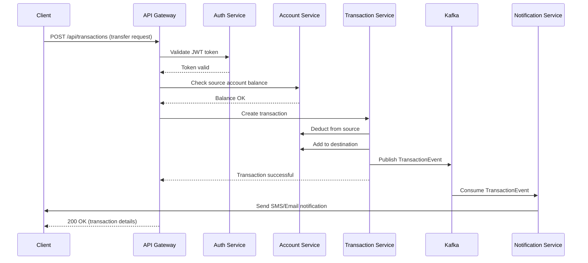

# TrioBank Platform Mimari Genel Bakış

## Sistem Mimarisi

TrioBank Platform, mikroservis mimarisine dayalı, event-driven, cloud-native bir bankacılık platformudur.

## Yüksek Seviye Mimari

```
┌─────────────────────────────────────────────────────────────────┐
│                         Client Layer                             │
├─────────────────────────────────────────────────────────────────┤
│  Web Portal  │  Mobile App  │  Admin Portal  │  Partner APIs   │
└──────┬───────────────┬───────────────┬───────────────┬──────────┘
       │               │               │               │
       └───────────────┴───────────────┴───────────────┘
                           │
                    ┌──────▼──────┐
                    │ API Gateway │ (Kong/Nginx)
                    │  + Auth     │
                    └──────┬──────┘
                           │
       ┌───────────────────┼───────────────────┐
       │                   │                   │
┌──────▼──────┐    ┌──────▼──────┐    ┌──────▼──────┐
│   Account   │    │Transaction  │    │   Payment   │
│   Service   │    │   Service   │    │   Service   │
│   (Java)    │    │   (Java)    │    │   (Java)    │
└──────┬──────┘    └──────┬──────┘    └──────┬──────┘
       │                   │                   │
       │            ┌──────▼──────┐           │
       │            │   Kafka     │           │
       │            │  (Message   │           │
       │            │   Broker)   │           │
       │            └──────┬──────┘           │
       │                   │                   │
┌──────▼──────┐    ┌──────▼──────┐    ┌──────▼──────┐
│  Customer   │    │  Analytics  │    │Notification │
│   Service   │    │   Service   │    │   Service   │
│   (Java)    │    │    (Go)     │    │   (Java)    │
└──────┬──────┘    └──────┬──────┘    └──────┬──────┘
       │                   │                   │
       └───────────────────┼───────────────────┘
                           │
                    ┌──────▼──────┐
                    │  Data Layer │
                    ├─────────────┤
                    │ PostgreSQL  │
                    │   Redis     │
                    │  MongoDB    │
                    └─────────────┘
```

## Mikroservis Detayları

### Core Banking Services (Java/Spring Boot)

#### 1. Auth Service (Port: 8082)
**Sorumluluklar:**
- Kullanıcı kimlik doğrulama
- JWT token yönetimi
- OAuth2 implementasyonu
- Role-based access control (RBAC)

**Teknolojiler:**
- Spring Security
- Spring OAuth2
- JWT
- Redis (token cache)

**Endpoints:**
- `POST /auth/login` - Kullanıcı girişi
- `POST /auth/register` - Kullanıcı kaydı
- `POST /auth/refresh` - Token yenileme
- `POST /auth/logout` - Çıkış

#### 2. Account Service (Port: 8080)
**Sorumluluklar:**
- Hesap oluşturma ve yönetimi
- Bakiye sorgulama
- Hesap durumu güncellemeleri
- Hesap tipleri (checking, savings, investment)

**Database:**
- PostgreSQL (accounts, balances)
- Redis (cache)

**Endpoints:**
- `POST /api/accounts` - Hesap oluştur
- `GET /api/accounts/{id}` - Hesap detayı
- `GET /api/accounts/{id}/balance` - Bakiye sorgula
- `PUT /api/accounts/{id}` - Hesap güncelle

#### 3. Transaction Service (Port: 8081)
**Sorumluluklar:**
- Para transferleri
- İşlem geçmişi
- İşlem onayları
- Fraud detection entegrasyonu

**Database:**
- PostgreSQL (transactions)
- Kafka (event streaming)

**Endpoints:**
- `POST /api/transactions` - Yeni işlem
- `GET /api/transactions/{id}` - İşlem detayı
- `GET /api/accounts/{accountId}/transactions` - Hesap işlemleri
- `POST /api/transactions/{id}/approve` - İşlem onayla

#### 4. Customer Service (Port: 8083)
**Sorumluluklar:**
- Müşteri profili yönetimi
- KYC (Know Your Customer) işlemleri
- Müşteri dokümantasyonu
- Adres ve iletişim bilgileri

**Database:**
- PostgreSQL (customers, documents)
- S3 (document storage)

**Endpoints:**
- `POST /api/customers` - Müşteri oluştur
- `GET /api/customers/{id}` - Müşteri detayı
- `PUT /api/customers/{id}` - Müşteri güncelle
- `POST /api/customers/{id}/documents` - Doküman yükle

#### 5. Payment Service (Port: 8084)
**Sorumluluklar:**
- Ödeme işlemleri
- Kredi/banka kartı işlemleri
- EFT/FAST entegrasyonu
- Ödeme gateway entegrasyonları

**Database:**
- PostgreSQL (payments)
- Redis (cache)

**Endpoints:**
- `POST /api/payments` - Ödeme yap
- `GET /api/payments/{id}` - Ödeme detayı
- `GET /api/payments/status/{id}` - Ödeme durumu
- `POST /api/payments/{id}/refund` - İade

#### 6. Notification Service (Port: 8085)
**Sorumluluklar:**
- Email bildirimleri
- SMS bildirimleri
- Push notifications
- Bildirim template yönetimi

**Teknolojiler:**
- SendGrid (email)
- Twilio (SMS)
- Firebase (push notifications)

**Endpoints:**
- `POST /api/notifications/email` - Email gönder
- `POST /api/notifications/sms` - SMS gönder
- `POST /api/notifications/push` - Push notification
- `GET /api/notifications/{id}` - Bildirim durumu

### Analytics & Reporting Services (Go)

#### 7. Analytics Service (Port: 9090)
**Sorumluluklar:**
- Real-time analytics
- Kullanıcı davranış analizi
- İşlem analizi
- Dashboard metrics

**Database:**
- TimescaleDB (time-series data)
- Redis (cache)

**Endpoints:**
- `GET /api/analytics/transactions` - İşlem analitiği
- `GET /api/analytics/users` - Kullanıcı analitiği
- `GET /api/analytics/revenue` - Gelir analitiği

#### 8. Reporting Service (Port: 9091)
**Sorumluluklar:**
- Rapor oluşturma
- Scheduled reports
- Export (PDF, Excel, CSV)
- Regulatory reports

**Database:**
- PostgreSQL (reports metadata)
- S3 (report storage)

**Endpoints:**
- `POST /api/reports` - Rapor oluştur
- `GET /api/reports/{id}` - Rapor indir
- `GET /api/reports` - Raporları listele

#### 9. Monitoring Service (Port: 9092)
**Sorumluluklar:**
- System health monitoring
- Performance metrics
- Alert management
- Service discovery

**Teknolojiler:**
- Prometheus (metrics)
- Grafana (visualization)

## Veri Akışı

### Para Transfer İşlemi Örneği



## Event-Driven Architecture

### Kafka Topics

```
triobank.transactions.created        # Yeni işlem oluşturuldu
triobank.transactions.completed      # İşlem tamamlandı
triobank.transactions.failed         # İşlem başarısız
triobank.accounts.created            # Yeni hesap oluşturuldu
triobank.accounts.updated            # Hesap güncellendi
triobank.customers.registered        # Yeni müşteri kaydı
triobank.payments.processed          # Ödeme işlendi
triobank.notifications.sent          # Bildirim gönderildi
```

## Güvenlik Mimarisi

### Katmanlar

1. **Network Layer**
   - WAF (Web Application Firewall)
   - DDoS protection
   - Rate limiting

2. **API Gateway Layer**
   - JWT validation
   - API key management
   - Request/response transformation
   - Rate limiting per client

3. **Service Layer**
   - mTLS (mutual TLS) between services
   - Service mesh (Istio/Linkerd)
   - Circuit breaker pattern
   - Request authentication

4. **Data Layer**
   - Encryption at rest
   - Encryption in transit
   - Database access control
   - Audit logging

### Kimlik Doğrulama Akışı

```
1. Client → API Gateway: Username + Password
2. API Gateway → Auth Service: Validate credentials
3. Auth Service → Database: Check user
4. Auth Service → Client: Return JWT token
5. Client → API Gateway: Subsequent requests with JWT
6. API Gateway: Validate JWT (cached in Redis)
7. API Gateway → Services: Forward with user context
```

## Deployment Mimarisi

### Kubernetes Namespaces

```yaml
namespaces:
  - triobank-ingress        # Ingress controllers, load balancers
  - triobank-services       # Mikroservisler
  - triobank-frontend       # Frontend apps
  - triobank-data          # Databases, Redis, Kafka
  - triobank-monitoring    # Prometheus, Grafana, Jaeger
  - triobank-logging       # ELK Stack
```

### High Availability

- **Multi-AZ deployment**: Her servis en az 2 availability zone'da
- **Auto-scaling**: HPA (Horizontal Pod Autoscaler) ile otomatik ölçeklendirme
- **Load balancing**: Service mesh ile intelligent load balancing
- **Circuit breakers**: Resilience4j ile fault tolerance
- **Health checks**: Liveness ve readiness probes

## Monitoring & Observability

### Metrikler

**Business Metrics:**
- Günlük işlem sayısı
- Başarılı/başarısız işlem oranı
- Ortalama işlem süresi
- Active users
- Revenue metrics

**Technical Metrics:**
- Request rate (req/sec)
- Response time (p50, p95, p99)
- Error rate
- CPU/Memory usage
- Database query performance

### Logging

**Log Levels:**
- ERROR: Hata durumları
- WARN: Uyarılar
- INFO: Genel bilgiler
- DEBUG: Detaylı debug bilgileri

**Log Format (JSON):**
```json
{
  "timestamp": "2024-01-15T10:30:00Z",
  "level": "INFO",
  "service": "account-service",
  "trace_id": "abc123",
  "span_id": "def456",
  "message": "Account created successfully",
  "user_id": "user123",
  "account_id": "acc456"
}
```

### Distributed Tracing

- **Jaeger**: Request tracing across services
- **Trace ID**: Her request için unique trace ID
- **Span**: Her servis call için span
- **Baggage**: Context propagation

## Disaster Recovery

### Backup Strategy

- **Database**: Daily full backup + continuous WAL archiving
- **Documents**: S3 with cross-region replication
- **Configuration**: Git repository + Kubernetes ConfigMaps

### Recovery Time Objectives

- **RTO (Recovery Time Objective)**: 4 saat
- **RPO (Recovery Point Objective)**: 1 saat

### Failover Scenarios

1. **Single service failure**: Kubernetes auto-restart
2. **Database failure**: Automatic failover to standby
3. **AZ failure**: Traffic rerouted to other AZs
4. **Region failure**: DR region activation (manual)

## Ölçeklenebilirlik

### Horizontal Scaling

Her servis bağımsız olarak ölçeklenir:

```yaml
# HPA Example
apiVersion: autoscaling/v2
kind: HorizontalPodAutoscaler
metadata:
  name: account-service
spec:
  scaleTargetRef:
    apiVersion: apps/v1
    kind: Deployment
    name: account-service
  minReplicas: 3
  maxReplicas: 20
  metrics:
  - type: Resource
    resource:
      name: cpu
      target:
        type: Utilization
        averageUtilization: 70
```

### Database Scaling

- **Read Replicas**: PostgreSQL read replicas for read-heavy workloads
- **Sharding**: Horizontal sharding by customer ID
- **Caching**: Redis for frequently accessed data
- **Connection Pooling**: PgBouncer for connection management

## Performans Hedefleri

| Metric | Target | Critical Threshold |
|--------|--------|-------------------|
| API Response Time (p95) | < 200ms | < 500ms |
| API Response Time (p99) | < 500ms | < 1s |
| Transaction Success Rate | > 99.9% | > 99% |
| System Uptime | 99.95% | 99.9% |
| Database Query Time | < 50ms | < 100ms |

## Teknoloji Kararları (ADR)

### ADR-001: Mikroservis Mimarisi
**Karar**: Monolitik yerine mikroservis mimarisi kullanılacak
**Sebep**: Ölçeklenebilirlik, bağımsız deployment, teknoloji çeşitliliği
**Sonuçlar**: Artan complexity, servisler arası iletişim overhead

### ADR-002: Java vs Go
**Karar**: Core banking Java, analytics/monitoring Go
**Sebep**: Java mature ecosystem, Go high performance
**Sonuçlar**: Multi-language expertise gerekli

### ADR-003: Kafka Message Broker
**Karar**: Kafka asenkron iletişim için kullanılacak
**Sebep**: High throughput, durability, replay capability
**Sonuçlar**: Operational complexity, learning curve

### ADR-004: Kubernetes Orchestration
**Karar**: Kubernetes container orchestration
**Sebep**: Industry standard, cloud agnostic, rich ecosystem
**Sonuçlar**: Steep learning curve, operational overhead
